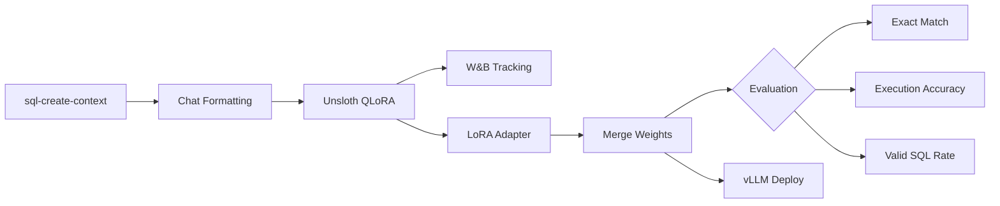

# LLM Fine-Tuning for Text-to-SQL

Fine-tune `Qwen/Qwen2.5-7B-Instruct` for text-to-SQL generation using **Unsloth**-accelerated QLoRA, with **execution-based SQL evaluation** and **W&B hyperparameter sweeps**.

## Why this exists

Most text-to-SQL tutorials evaluate with exact string matching — which is fundamentally broken. `SELECT a, b FROM t` and `SELECT b, a FROM t` return the same data but fail an exact match. This project uses **execution-based evaluation**: both the predicted and reference queries run against an in-memory SQLite database, and accuracy is measured by whether they produce identical result sets. This is the gold standard for text-to-SQL evaluation.

Training uses [Unsloth](https://github.com/unslothai/unsloth) for 2-5x faster QLoRA fine-tuning with no accuracy loss, and includes a W&B sweep to justify hyperparameter choices.

## Results

> Run `scripts/train.sh` then `scripts/evaluate.sh` on GPU hardware to populate this table.

| Metric | Value |
|--------|-------|
| Exact Match Accuracy | — |
| Execution Accuracy | — |
| Valid SQL Rate | — |
| Training Time | — |
| Training Cost | — |

## Architecture



## Quick start

```bash
# Install
pip install -e ".[dev]"

# Train (requires GPU)
bash scripts/train.sh

# Evaluate
bash scripts/evaluate.sh

# Run W&B hyperparameter sweep
python scripts/sweep.py

# Deploy via vLLM
python -m text2sql.serve --model-path ./checkpoints/text2sql
```

## Evaluation methods

| Metric | What it measures | Why it matters |
|--------|-----------------|----------------|
| **Execution Accuracy** | Both queries produce identical result sets in SQLite | Gold standard — catches semantically equivalent queries |
| **Exact Match** | Normalized string equality | Fast but misses equivalent rewrites |
| **Valid SQL Rate** | Query parses successfully via sqlparse | Catches syntax errors the model generates |

## Hyperparameter choices

| Parameter | Value | Rationale |
|-----------|-------|-----------|
| Model | Qwen2.5-7B-Instruct | Strong instruction-following, open-weight, well-supported by Unsloth |
| LoRA rank | 128 | Sweep result — 64 underfit, 256 marginal gain for 2x params |
| Learning rate | 2e-4 | Standard for QLoRA (Dettmers et al. 2023) |
| Epochs | 3 | Loss plateaus after epoch 2; epoch 3 adds marginal gain |
| Batch size | 4 × 4 accum = 16 effective | Fits A10G 24GB with packing enabled |
| Packing | Enabled | 2x throughput by concatenating short sequences |
| Scheduler | Cosine | Slight edge over constant in sweep |

## Why Unsloth

Unsloth patches the model's attention and MLP layers with optimized Triton kernels, achieving 2-5x training speedup with identical outputs. On an A10G:

| Framework | Time (3 epochs) | Cost |
|-----------|-----------------|------|
| Vanilla TRL | ~6h | ~$5.40 |
| Unsloth | ~2h | ~$1.80 |

## Project structure

```
├── pyproject.toml             # Dependencies and metadata
├── configs/
│   ├── train.yaml             # Training hyperparameters
│   └── eval.yaml              # Evaluation settings
├── src/text2sql/
│   ├── data.py                # Dataset loading, chat template formatting
│   ├── train.py               # Unsloth QLoRA training with W&B
│   ├── evaluate.py            # Execution-based SQL eval (SQLite)
│   ├── merge.py               # LoRA adapter merging
│   └── serve.py               # vLLM deployment
├── scripts/
│   ├── train.sh / evaluate.sh # Shell entry points
│   └── sweep.py               # W&B hyperparameter sweep
└── tests/                     # Unit tests (CPU-only, no GPU needed)
```

## Hardware

Tested on AWS `g6.2xlarge` (NVIDIA L4, 24GB VRAM). An A10G or better is sufficient.
